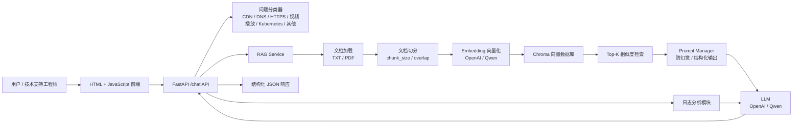

# CloudSupport AI

CloudSupport AI 是一个面向云产品技术支持场景的 AI 助手项目。系统基于 FastAPI、LangChain、Chroma 和大模型 API 构建，支持用户输入技术问题后自动分类、检索本地知识库、生成结构化排障答案，并提供 HTTP 日志分析能力。

该项目适合作为 AI 应用工程、RAG 系统设计、后端架构和技术支持自动化方向的面试展示项目。

## 技术架构



## 功能说明

### AI 技术支持问答

- 提供 `/chat` 接口，接收用户技术问题。
- 自动识别问题类型，包括 `CDN`、`DNS`、`HTTPS`、`视频播放`、`Kubernetes` 和 `其他`。
- 基于知识库检索相关内容，并结合大模型生成技术支持答案。
- 返回结构化 JSON，包含问题分类、回答、检索内容、引用来源和元数据。

### RAG 知识库检索

- 支持加载本地 `txt` 和 `pdf` 文档。
- 支持 `chunk_size` 和 `chunk_overlap` 参数配置。
- 使用 Embedding 模型将文档切片向量化。
- 使用 Chroma 作为本地持久化向量数据库。
- 支持 Top-K 相似度检索，并将检索内容拼接进 Prompt。

### Prompt 管理

- 主问答 Prompt。
- RAG 增强 Prompt，强调基于上下文回答，降低幻觉。
- 日志分析 Prompt。
- 工单分类 Prompt。
- 统一要求输出合法 JSON，便于前后端集成。

### 日志分析

- 支持输入 HTTP 响应或日志文本。
- 使用 LLM 分析问题类型、状态码含义、问题原因和排查建议。
- 内置常见状态码知识：
  - `502 Bad Gateway`
  - `504 Gateway Timeout`
  - `499 Client Closed Request`

## 快速启动

### 1. 准备环境变量

在项目根目录创建 `.env`：

```bash
OPENAI_API_KEY=your_openai_key
LLM_PROVIDER=openai
EMBEDDING_PROVIDER=openai

# 可选：使用 Qwen / DashScope
# LLM_PROVIDER=qwen
# EMBEDDING_PROVIDER=qwen
# DASHSCOPE_API_KEY=your_dashscope_key
```

### 2. 准备知识库

建议目录结构：

```text
knowledge/
├── cdn/
├── dns/
├── https/
├── video/
├── kubernetes/
└── general/
```

将 `.txt` 或 `.pdf` 知识库文件放入对应目录。

### 3. Docker 一键启动

```bash
docker compose up --build
```

服务启动后访问：

```text
http://localhost:8000/docs
```

### 4. 调用示例

```bash
curl -X POST http://localhost:8000/chat \
  -H "Content-Type: application/json" \
  -d '{"question":"视频播放首帧很慢，应该怎么排查？"}'
```

示例响应：

```json
{
  "question": "视频播放首帧很慢，应该怎么排查？",
  "category": "视频播放",
  "answer": "...",
  "retrieved_contents": [],
  "references": [],
  "metadata": {
    "chunk_size": 800,
    "chunk_overlap": 120,
    "retrieval_top_k": 4,
    "has_context": true
  }
}
```

## 示例截图

> 面试或项目展示时可替换为真实截图。

### 聊天页面


### API 文档


### 日志分析结果


## 项目亮点

### 1. RAG 工程闭环

项目实现了从文档加载、切分、向量化、入库、检索到答案生成的完整链路，不只是简单调用大模型。知识库可以本地维护，向量数据库持久化，便于扩展到真实企业知识库场景。

### 2. 面向技术支持的排障流程

回答不是泛泛生成文本，而是围绕技术支持场景组织输出，包括问题分类、可能原因、排查步骤、建议动作和缺失信息，更贴近一线支持工程师工作流。

### 3. 防幻觉 Prompt 设计

RAG Prompt 明确要求优先基于检索上下文回答，当上下文不足时说明信息缺口，降低大模型编造配置项、错误码含义或产品能力的风险。

### 4. 日志分析能力

项目独立实现日志分析模块，支持常见 HTTP 状态码解释和排障建议，覆盖 `502`、`504`、`499` 等技术支持高频问题。

### 5. 可扩展架构

模块划分清晰：

- `main.py`: FastAPI 入口
- `rag_service.py`: RAG 主流程
- `prompt_manager.py`: Prompt 管理
- `classifier.py`: 技术问题分类
- `log_analyzer.py`: 日志分析

后续可扩展多租户知识库、异步任务、对话历史、工单系统集成、RAG 评测和人工反馈闭环。

## 目录结构

```text
.
├── main.py
├── rag_service.py
├── prompt_manager.py
├── classifier.py
├── log_analyzer.py
├── index.html
├── requirements.txt
├── Dockerfile
├── docker-compose.yml
└── README.md
```

## 面试讲解建议

可以从以下几个角度介绍该项目：

- 为什么技术支持场景适合 RAG，而不是只使用通用大模型。
- 如何通过分类器将问题路由到不同知识库。
- 如何设计 chunk 参数、Top-K 检索和 Prompt，平衡召回率与答案准确性。
- 如何处理大模型幻觉、上下文不足和结构化输出。
- 如何将日志分析能力接入真实排障流程。
