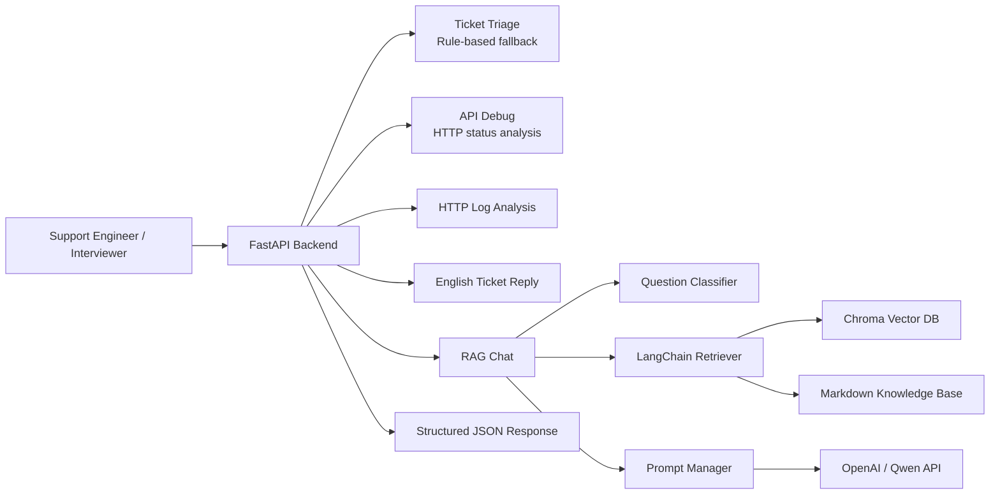

# CloudSupport AI

CloudSupport AI 是一个面向云产品与大模型产品技术支持场景的 **AI Support Copilot 原型项目**，用于模拟一线技术支持中的工单分诊、知识库检索、API 报错分析、HTTP 日志分析、英文客户回复生成与升级信息收集流程。

项目基于 `Python`、`FastAPI`、`Pydantic`、`RAG`、`Prompt Engineering`、`Postman` 和 `Docker` 构建，重点展示 AI 技术支持、云计算技术支持、大模型产品支持岗位所需的 API 调试、排障分析、知识库沉淀和客户沟通能力。

本项目是个人实践项目，使用模拟样例内容，重点展示工程思路和支持工作流。

## Target Roles

- AI 技术支持工程师
- 云计算技术支持工程师
- 大模型技术支持工程师
- 海外技术支持工程师
- LLM Support Engineer
- AI Solution Support Engineer

## Tech Stack

- Backend: `Python`, `FastAPI`, `Pydantic`
- RAG: `LangChain`, `Chroma`, `Embedding`, `Top-K Retrieval`
- LLM API: `OpenAI / Qwen compatible API`
- Prompt: `Prompt Engineering`, structured output, anti-hallucination constraints
- Deployment: `Docker`, `docker-compose`
- API Testing: `Postman`, `curl`
- Knowledge Base: Markdown support documents

## Core Features

| Feature | API | Description |
| --- | --- | --- |
| Health Check | `GET /health` | Check service availability |
| RAG Chat | `POST /chat` | Retrieve support knowledge and generate an answer |
| Ticket Triage | `POST /ticket-triage` | Classify ticket category, priority, support team, and missing information |
| API Debug | `POST /api-debug` | Analyze API errors such as 401, 403, 429, 5xx |
| Log Analysis | `POST /log-analyze` | Analyze HTTP logs such as 499, 502, 504, timeout |
| Ticket Reply | `POST /ticket-reply` | Generate a professional English customer reply draft |

## Architecture



## Demo Screenshots

### Swagger API Docs


### Ticket Triage


### API Debug


### English Ticket Reply


## Project Structure

```text
.
├── main.py
├── rag_service.py
├── prompt_manager.py
├── classifier.py
├── log_analyzer.py
├── index.html
├── knowledge/
│   ├── cdn/
│   ├── dns/
│   ├── https/
│   ├── video/
│   ├── kubernetes/
│   └── llm/
├── examples/
├── postman/
├── eval/
├── TEST_RESULT.md
├── Dockerfile
├── docker-compose.yml
├── requirements.txt
├── README.md
└── README_EN.md
```

## Knowledge Base

`knowledge/` 目录提供云计算和大模型技术支持场景的 Markdown 样例，适合被 RAG 模块加载、切分、向量化并写入 Chroma。

```text
knowledge/
├── cdn/            # CDN 502/504, cache miss, high TTFB
├── dns/            # DNS resolution failure
├── https/          # TLS certificate issue
├── video/          # first frame slow, HLS playback stutter
├── kubernetes/     # Pod Pending
└── llm/            # LLM API errors, Prompt, RAG, Function Calling
```

知识库文档采用统一技术支持结构：

- Scenario / 适用场景
- Symptoms / 常见现象
- Possible Causes / 可能原因
- Troubleshooting Steps / 排查步骤
- Required Information / 客户需要提供的信息
- Escalation Criteria / 升级专家或研发的条件

## Quick Start

### 1. Clone

```bash
git clone https://github.com/HAHAL/cloudsupport-ai.git
cd cloudsupport-ai
```

### 2. Environment Variables

规则兜底接口可以在没有 LLM API Key 的情况下运行：

```bash
touch .env
```

完整 `/chat` RAG 流程需要配置 LLM 和 Embedding API Key：

```env
LLM_PROVIDER=openai
EMBEDDING_PROVIDER=openai
OPENAI_API_KEY=your_openai_key

# Or Qwen / DashScope compatible endpoint
# LLM_PROVIDER=qwen
# EMBEDDING_PROVIDER=qwen
# DASHSCOPE_API_KEY=your_dashscope_key
```

### 3. Docker

```bash
docker compose up --build -d
```

Check service:

```bash
docker compose ps
docker compose logs -f
```

Open Swagger:

```text
http://localhost:8000/docs
```

## API Endpoints

| API | Method | Purpose |
| --- | --- | --- |
| `/health` | GET | Service health check |
| `/docs` | GET | Swagger API documentation |
| `/chat` | POST | RAG-based support Q&A |
| `/ticket-triage` | POST | Ticket classification and triage |
| `/api-debug` | POST | API error troubleshooting |
| `/log-analyze` | POST | HTTP log analysis |
| `/ticket-reply` | POST | English customer reply generation |

## curl Examples

### Health Check

```bash
curl http://localhost:8000/health
```

### Ticket Triage

```bash
curl -X POST http://localhost:8000/ticket-triage \
  -H "Content-Type: application/json" \
  -d '{
    "title": "CDN accelerated API returns intermittent 504 in Singapore",
    "description": "The customer reports 504 through CDN. Nginx log shows request_time=60.001 and upstream_response_time=60.000.",
    "customer_level": "enterprise",
    "affected_product": "BytePlus CDN"
  }'
```

### API Debug

```bash
curl -X POST http://localhost:8000/api-debug \
  -H "Content-Type: application/json" \
  -d '{
    "method": "POST",
    "url": "https://ark.ap-southeast.byteplusapi.com/api/v3/chat/completions",
    "status_code": 429,
    "error_message": "Rate limit exceeded for model endpoint",
    "request_id": "req_demo_429"
  }'
```

### Log Analysis

```bash
curl -X POST http://localhost:8000/log-analyze \
  -H "Content-Type: application/json" \
  -d '{
    "log_text": "status=504 request_time=60.001 upstream_response_time=60.000 error=upstream timed out",
    "question": "Why does the CDN request return 504?"
  }'
```

### Ticket Reply

```bash
curl -X POST http://localhost:8000/ticket-reply \
  -H "Content-Type: application/json" \
  -d '{
    "ticket_title": "LLM Function Calling schema validation failed",
    "ticket_description": "Some requests return tool arguments that fail JSON schema validation.",
    "analysis_context": "Missing required fields order_id and action_type. Need raw response, schema and request_id.",
    "customer_name": "Customer"
  }'
```

### RAG Chat

```bash
curl -X POST http://localhost:8000/chat \
  -H "Content-Type: application/json" \
  -d '{
    "question": "CDN returns intermittent 504, how should we troubleshoot it?"
  }'
```

## Postman Usage

Import the collection:

```text
postman/CloudSupport-AI.postman_collection.json
```

Default variable:

```text
base_url = http://localhost:8000
```

Example request bodies:

```text
examples/
├── cdn_504_ticket.json
├── llm_api_401_error.json
├── llm_api_429_error.json
├── video_first_frame_slow.json
└── english_ticket_reply.json
```

## Test Result

See [TEST_RESULT.md](TEST_RESULT.md).

Summary:

- Rule-based APIs can run without an LLM API key.
- `/chat` requires a valid LLM and embedding API key for full RAG behavior.
- `/docs` exposes all API endpoints for Swagger testing.

## Interview Talking Points

- Why RAG is suitable for technical support scenarios
- How ticket triage helps improve first response quality
- How to troubleshoot LLM API errors such as 401, 429 and 5xx
- How Prompt Engineering is used to control output format and reduce hallucination
- How English ticket replies can reduce communication cost for overseas customers
- How to collect required information before escalating issues
- What should be added before production use: authentication, rate limiting, monitoring, evaluation, access control and audit logs

## Limitations and Future Improvements

This project is a personal practice and interview demo project, not a production system.

Future improvements:

- Add authentication and role-based access control
- Add API rate limiting and request audit logs
- Add Prometheus and Grafana monitoring
- Add RAG evaluation dataset and answer quality scoring
- Add multi-tenant knowledge base isolation
- Add conversation history and ticket context memory
- Add CI/CD workflow for automated tests
- Add persistent ticket storage and search
- Add frontend UI for support engineers

## Scope

- This is a personal practice and interview demo project.
- The examples and knowledge base files use simulated support scenarios.
- Rule-based fallback logic is used for stable demonstration.
- Full RAG behavior requires valid LLM and embedding API keys.
