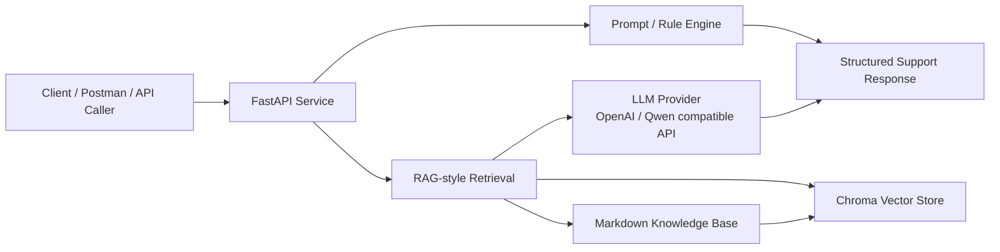
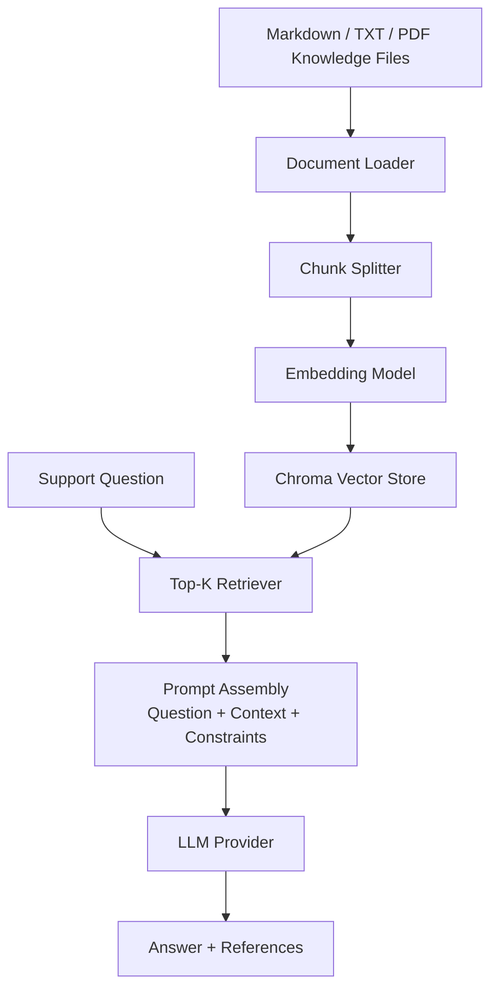

# CloudSupport AI

面向云产品与大模型技术支持场景的 AI Support Workflow Prototype

CloudSupport AI 是一个轻量级 AI 辅助技术支持工作流原型，面向云产品和 LLM API 支持场景。它用于将重复出现的支持问题沉淀为结构化的诊断、分诊、回复生成和升级信息收集流程。

## 项目概览

CloudSupport AI 用于验证 AI 辅助技术支持工作流，覆盖知识库检索、工单分诊、API 报错分析、HTTP 日志分析、客户回复生成和升级信息收集等环节。

后端提供 RESTful API，并以结构化 JSON 返回结果。部分工作流采用稳定的规则兜底逻辑，因此在没有 LLM API Key 的情况下也可以本地运行。`/chat` 接口展示了 RAG 风格的知识库问答流程，包括 Markdown 知识库、Embedding、Chroma 检索、Prompt 构造和外部 LLM Provider 调用。

## 背景

技术支持团队在日常工作中经常遇到以下问题：

- 重复问题较多，占用一线支持时间。
- 知识库检索效率不稳定。
- 工单分类依赖工程师经验。
- `401`、`429`、`502`、`504` 等 API 报错需要快速定位。
- HTTP 日志需要转换为可执行的排查步骤。
- 客户回复需要保持专业、克制、证据明确。
- 新成员需要参考标准化排障路径。

CloudSupport AI 提供一个紧凑的工作流原型，用于验证这些技术支持场景。

## 核心功能

1. 技术支持知识库问答
2. 工单分诊
3. API 报错分析
4. HTTP 日志分析
5. 客户回复生成
6. 升级信息收集
7. RAG 风格知识库检索
8. Docker 化部署

## 系统架构



## LLM API 支持场景

CloudSupport AI 重点覆盖大模型 API 售后支持中的高频问题：

- `401 Unauthorized`: API Key 错误、Token 过期、签名失败、鉴权 Header 缺失。
- `403 Forbidden`: 模型权限不足、账号权限不足、区域限制、安全策略拦截。
- `400 Bad Request`: 参数错误、模型名称错误、消息格式错误、上下文超长。
- `429 Too Many Requests`: QPS、RPM、TPM、并发数、配额或账单限制。
- `408 / 504 / timeout`: 网络超时、模型推理耗时过长、网关超时、请求体过大。
- `5xx`: 模型服务异常、平台波动、上游服务异常或临时不可用。
- `stream interrupted`: 流式输出被代理、网关、客户端超时或网络中断。
- `context_length_exceeded`: 输入上下文超过模型窗口。

这些场景通过 `/api-debug`、`/log-analyze`、`/ticket-reply` 和 `/escalation-info` 组合成一个轻量支持工作流。

## RAG 知识库流程



RAG 流程用于把支持知识库中的排障步骤、状态码解释和升级条件检索出来，再与用户问题拼接成受约束的 Prompt，最终返回答案和引用来源。

## Prompt 模板设计

项目中的 Prompt 设计遵循以下原则：

1. 明确角色：技术支持专家、日志分析专家、工单分诊专家或客户回复助手。
2. 明确输入：问题、上下文、日志、工单描述、状态码、缺失信息。
3. 明确输出：要求结构化 JSON 或专业客户回复。
4. 明确约束：不要编造上下文不存在的信息；证据不足时输出需要补充的信息。
5. 明确升级条件：当问题需要专项支持或产品工程确认时，收集 request ID、时间、区域、日志和复现步骤。

更详细的模板说明见 [docs/prompt-templates.md](docs/prompt-templates.md)。

## 技术栈

- Python
- FastAPI
- Pydantic
- Markdown Knowledge Base
- LangChain
- Chroma
- Embedding
- Docker
- Postman
- RESTful API
- LLM API / Mockable LLM Provider

## 项目结构

```text
.
├── main.py
├── rag_service.py
├── prompt_manager.py
├── classifier.py
├── log_analyzer.py
├── index.html
├── knowledge/
│   ├── cdn/
│   ├── dns/
│   ├── https/
│   ├── video/
│   ├── kubernetes/
│   └── llm/
├── examples/
├── postman/
├── eval/
├── TEST_RESULT.md
├── Dockerfile
├── docker-compose.yml
├── requirements.txt
├── README.md
└── README_EN.md
```

## 快速启动

### 本地启动

```bash
git clone https://github.com/HAHAL/cloudsupport-ai.git
cd cloudsupport-ai
python -m venv .venv
source .venv/bin/activate
pip install -r requirements.txt
uvicorn main:app --reload --port 8000
```

### Docker 启动

```bash
docker compose up --build -d
docker compose ps
docker compose logs -f
```

### 环境变量

规则兜底类接口不依赖 LLM API Key，可以先创建空 `.env`：

```bash
touch .env
```

完整 `/chat` RAG 流程需要配置 LLM 和 Embedding Provider：

```env
LLM_PROVIDER=openai
EMBEDDING_PROVIDER=openai
OPENAI_API_KEY=your_openai_key

# 或使用 Qwen / DashScope compatible endpoint
# LLM_PROVIDER=qwen
# EMBEDDING_PROVIDER=qwen
# DASHSCOPE_API_KEY=your_dashscope_key
```

## API 文档

启动后访问 Swagger / OpenAPI 文档：

```text
http://localhost:8000/docs
```

## API 示例

### `POST /chat`

**适用场景：** 输入技术支持问题，检索知识库上下文并生成回答。

**请求示例**

```bash
curl -X POST http://localhost:8000/chat \
  -H "Content-Type: application/json" \
  -d '{
    "question": "CDN returns intermittent 504, how should we troubleshoot it?"
  }'
```

**响应示例**

```json
{
  "question": "CDN returns intermittent 504, how should we troubleshoot it?",
  "category": "CDN",
  "answer": "The issue may be related to origin timeout or upstream response latency...",
  "retrieved_contents": [],
  "references": [],
  "metadata": {
    "retrieval_top_k": 4,
    "has_context": true
  }
}
```

### `POST /ticket-triage`

**适用场景：** 对技术支持工单进行分类，识别优先级、支持团队、缺失信息和下一步动作。

**请求示例**

```bash
curl -X POST http://localhost:8000/ticket-triage \
  -H "Content-Type: application/json" \
  -d '{
    "title": "CDN accelerated API returns intermittent 504 in Singapore",
    "description": "The customer reports 504 through CDN. Nginx log shows request_time=60.001 and upstream_response_time=60.000.",
    "customer_level": "enterprise",
    "affected_product": "CDN"
  }'
```

**响应示例**

```json
{
  "category": "CDN",
  "priority": "p1",
  "intent": "troubleshooting",
  "assigned_team": "Edge Network / CDN Support Team",
  "reason": "The ticket matches CDN support signals...",
  "keywords": ["cdn", "504"],
  "missing_info": ["request ID or trace ID", "client region or source IP"],
  "next_actions": ["Compare request_time and upstream_response_time"],
  "confidence": 0.78
}
```

### `POST /api-debug`

**适用场景：** 分析 API 调用失败，例如鉴权失败、配额限制、限流和服务端错误。

**请求示例**

```bash
curl -X POST http://localhost:8000/api-debug \
  -H "Content-Type: application/json" \
  -d '{
    "method": "POST",
    "url": "https://api.example.com/v1/chat/completions",
    "status_code": 429,
    "error_message": "Rate limit exceeded for model endpoint",
    "request_id": "req_demo_429"
  }'
```

**响应示例**

```json
{
  "problem_type": "rate_limited",
  "status_code_explanation": "429 Too Many Requests means the request hit a rate limit...",
  "likely_causes": ["RPM/TPM/QPS limit exceeded"],
  "troubleshooting_steps": ["Add retry with exponential backoff and jitter"],
  "required_info": ["response body or error response snippet"],
  "severity": "medium",
  "confidence": 0.82
}
```

### `POST /log-analyze`

**适用场景：** 将 HTTP 访问日志或应用日志转换为结构化排查建议。

**请求示例**

```bash
curl -X POST http://localhost:8000/log-analyze \
  -H "Content-Type: application/json" \
  -d '{
    "log_text": "status=504 request_time=60.001 upstream_response_time=60.000 error=upstream timed out",
    "question": "Why does the CDN request return 504?"
  }'
```

**响应示例**

```json
{
  "problem_type": "gateway_timeout",
  "status_code_explanation": "504 Gateway Timeout means the CDN, gateway, or load balancer timed out...",
  "problem_causes": ["Origin response latency is high"],
  "troubleshooting_suggestions": ["Compare request_time and upstream_response_time"],
  "detected_status_codes": [504],
  "evidence": ["status=504 request_time=60.001 upstream_response_time=60.000 error=upstream timed out"],
  "missing_info": ["request_id / trace_id"],
  "confidence": 0.84
}
```

### `POST /ticket-reply`

**适用场景：** 根据问题上下文生成面向客户的专业回复草稿。

**请求示例**

```bash
curl -X POST http://localhost:8000/ticket-reply \
  -H "Content-Type: application/json" \
  -d '{
    "ticket_title": "LLM Function Calling schema validation failed",
    "ticket_description": "Some requests return tool arguments that fail JSON schema validation.",
    "analysis_context": "Missing required fields order_id and action_type. Need raw response, schema and request_id.",
    "customer_name": "Customer"
  }'
```

**响应示例**

```json
{
  "subject": "Initial troubleshooting request for: LLM Function Calling schema validation failed",
  "reply": "Dear Customer,\n\nThank you for contacting us...",
  "action_items": ["Confirm the model name, endpoint, workspace, and SDK version"],
  "need_customer_confirm": ["request ID or trace ID"],
  "tone": "professional",
  "confidence": 0.76
}
```

### `POST /escalation-info`

**适用场景：** 在升级给专项支持或产品工程团队前，收集必要的排障信息和证据。

**请求示例**

```bash
curl -X POST http://localhost:8000/escalation-info \
  -H "Content-Type: application/json" \
  -d '{
    "issue_summary": "LLM API returns intermittent 5xx for streaming requests",
    "product_area": "LLM",
    "observed_error": "status=502, stream interrupted",
    "business_impact": "Affects a customer service chatbot integration test"
  }'
```

**响应示例**

```json
{
  "category": "LLM",
  "escalation_team": "LLM API Support Team",
  "required_information": ["request ID or trace ID", "timestamp with timezone and issue duration"],
  "suggested_summary": "Category: LLM. Issue summary: LLM API returns intermittent 5xx for streaming requests...",
  "escalation_criteria": ["The issue affects multiple users, regions, or critical business paths"],
  "confidence": 0.78
}
```

## 知识库

Markdown 知识库覆盖以下方向：

- CDN
- DNS
- HTTPS
- HTTP 状态码
- Video Streaming
- Kubernetes
- LLM API
- Rate Limit
- Timeout
- Authentication Error
- Prompt optimization
- RAG retrieval quality
- Function Calling schema issues

文档采用统一的技术支持结构：

```text
Scenario
Symptoms
Possible Causes
Troubleshooting Steps
Required Information
Escalation Criteria
```

## Postman 使用

导入 Collection：

```text
postman/CloudSupport-AI.postman_collection.json
```

默认变量：

```text
base_url = http://localhost:8000
```

示例请求体位于：

```text
examples/
```

## 相关文档

- [LLM API 错误码排查](docs/llm-api-troubleshooting.md)
- [RAG 工作流与检索质量排查](docs/rag-workflow.md)
- [Prompt 模板设计](docs/prompt-templates.md)
- [客户回复模板](docs/customer-reply-templates.md)

## 测试结果

详见 [TEST_RESULT.md](TEST_RESULT.md)。

## 设计说明

1. 将规则逻辑与 LLM 输出结合，是因为很多支持工作流需要在 LLM Provider 不可用时仍能稳定返回首轮排查结果。
2. 支持响应采用结构化 JSON，便于前端、工单系统或自动化流程展示诊断结果、缺失信息、下一步动作和升级条件。
3. 显式收集升级信息，可以减少一线支持与专项团队之间的反复沟通。
4. 使用 Markdown 知识库是为了让知识内容易于审阅、版本管理和更新，同时支持轻量级 RAG 检索。
5. 后续可以通过字段映射接入内部工单系统，将分析结果写回工单备注、建议回复或升级摘要。

## 限制说明

本项目是用于技术支持工作流验证的原型项目。默认不连接客户数据或工单系统。

规则兜底流程主要用于本地开发和工作流验证。`/chat` 接口如需完整 RAG 能力，需要有效的 LLM 和 Embedding 凭证。

## Roadmap

- 接入真实向量数据库
- 集成工单系统
- 增加认证与权限控制
- 增加可观测性指标
- 增加多租户知识库隔离
- 增加支持答案评测数据集
- 增加 Web UI
