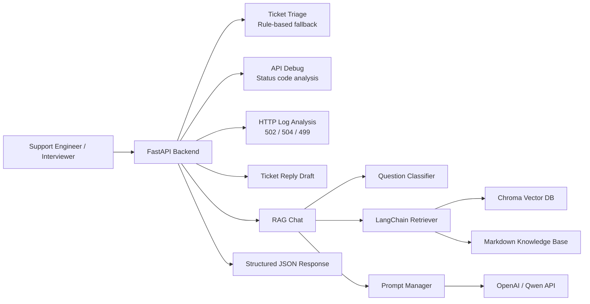

# CloudSupport AI

CloudSupport AI 是一个面向 **云产品与大模型产品一线技术支持** 的 AI 助手演示项目。项目模拟技术支持工程师的日常工作流：接收客户问题、进行工单分诊、检索知识库、分析 API 报错、分析 HTTP 日志，并生成面向海外客户的英文回复草稿。

本项目使用模拟样例内容，主要用于展示 AI 技术支持、云计算技术支持、大模型技术支持和海外技术支持岗位所需的工程理解与排障思路。

## 适合岗位

- AI 技术支持工程师
- 云计算技术支持工程师
- 大模型技术支持工程师
- 海外技术支持 / Technical Support Engineer
- RAG 应用工程 / AI Solution Support 相关岗位

## 技术栈

- Backend: `Python`, `FastAPI`, `Pydantic`
- RAG: `LangChain`, `Chroma`, `Embedding`, `Top-K Retrieval`
- LLM Integration: `OpenAI / Qwen compatible API`
- Prompt: `Prompt Engineering`, `结构化输出`, `防幻觉约束`
- DevOps: `Docker`, `docker-compose`
- API Testing: `Postman`, `curl`
- Knowledge Base: Markdown 技术支持知识库

## 核心能力

| 能力 | 接口 | 说明 |
| --- | --- | --- |
| 健康检查 | `GET /health` | 检查服务是否可用 |
| RAG 问答 | `POST /chat` | 基于知识库检索并生成技术支持回答 |
| 工单分诊 | `POST /ticket-triage` | 判断问题类别、优先级、分派团队和缺失信息 |
| API 报错分析 | `POST /api-debug` | 分析 401、403、429、5xx 等 API 调用失败 |
| HTTP 日志分析 | `POST /log-analyze` | 分析 499、502、504、timeout 等日志问题 |
| 英文客户回复 | `POST /ticket-reply` | 生成专业、清晰的英文/客户沟通回复草稿 |

## 技术架构



## 项目结构

```text
.
├── main.py                         # FastAPI 入口与接口定义
├── rag_service.py                  # RAG 文档加载、切分、检索和问答流程
├── prompt_manager.py               # Prompt 模板管理
├── classifier.py                   # 技术问题分类器
├── log_analyzer.py                 # 日志分析模块
├── index.html                      # 简单聊天页面
├── knowledge/                      # Markdown 技术支持知识库
│   ├── cdn/
│   ├── dns/
│   ├── https/
│   ├── video/
│   ├── kubernetes/
│   └── llm/
├── examples/                       # API 请求样例
├── postman/                        # Postman Collection
├── Dockerfile
├── docker-compose.yml
├── requirements.txt
├── README.md
└── README_EN.md
```

## 知识库目录说明

`knowledge/` 目录提供云计算和大模型技术支持场景的 Markdown 样例，适合被 RAG 模块加载、切分、向量化并写入 Chroma。

```text
knowledge/
├── cdn/            # CDN 502/504、cache miss、high TTFB
├── dns/            # DNS resolution failure
├── https/          # TLS certificate issue
├── video/          # first frame slow、HLS playback stutter
├── kubernetes/     # Pod Pending
└── llm/            # LLM API errors、Prompt、RAG、Function Calling
```

每篇知识库文档通常包含：

- 适用场景
- 常见现象
- 可能原因
- 排查步骤
- 客户需要提供的信息
- 升级专家/研发的条件

## 快速启动

### 1. 克隆项目

```bash
git clone https://github.com/HAHAL/cloudsupport-ai.git
cd cloudsupport-ai
```

### 2. 准备环境变量

如果只想查看 `/health`、`/docs`、`/ticket-triage`、`/api-debug`、`/log-analyze`、`/ticket-reply`，可以先创建空 `.env`：

```bash
touch .env
```

如果需要完整体验 `/chat` 的 RAG + LLM 回答，需要配置模型 API Key：

```env
LLM_PROVIDER=openai
EMBEDDING_PROVIDER=openai
OPENAI_API_KEY=your_openai_key

# 或使用 Qwen / DashScope compatible endpoint
# LLM_PROVIDER=qwen
# EMBEDDING_PROVIDER=qwen
# DASHSCOPE_API_KEY=your_dashscope_key
```

### 3. Docker 启动

```bash
docker compose up --build -d
```

查看服务状态：

```bash
docker compose ps
docker compose logs -f
```

访问接口文档：

```text
http://localhost:8000/docs
```

## curl 示例

### Health Check

```bash
curl http://localhost:8000/health
```

### 工单分诊

```bash
curl -X POST http://localhost:8000/ticket-triage \
  -H "Content-Type: application/json" \
  -d '{
    "title": "CDN accelerated API returns intermittent 504 in Singapore",
    "description": "The customer reports 504 through CDN. Nginx log shows request_time=60.001 and upstream_response_time=60.000.",
    "customer_level": "enterprise",
    "affected_product": "BytePlus CDN"
  }'
```

### API 报错分析

```bash
curl -X POST http://localhost:8000/api-debug \
  -H "Content-Type: application/json" \
  -d '{
    "method": "POST",
    "url": "https://ark.ap-southeast.byteplusapi.com/api/v3/chat/completions",
    "status_code": 429,
    "error_message": "Rate limit exceeded for model endpoint",
    "request_id": "req_demo_429"
  }'
```

### HTTP 日志分析

```bash
curl -X POST http://localhost:8000/log-analyze \
  -H "Content-Type: application/json" \
  -d '{
    "log_text": "status=504 request_time=60.001 upstream_response_time=60.000 error=upstream timed out",
    "question": "Why does the CDN request return 504?"
  }'
```

### 英文客户回复生成

```bash
curl -X POST http://localhost:8000/ticket-reply \
  -H "Content-Type: application/json" \
  -d '{
    "ticket_title": "LLM Function Calling schema validation failed",
    "ticket_description": "Some requests return tool arguments that fail JSON schema validation.",
    "analysis_context": "Missing required fields order_id and action_type. Need raw response, schema and request_id.",
    "customer_name": "Customer"
  }'
```

### RAG 问答

```bash
curl -X POST http://localhost:8000/chat \
  -H "Content-Type: application/json" \
  -d '{
    "question": "CDN cache miss and high TTFB should be troubleshooted from which steps?"
  }'
```

说明：`/chat` 会初始化 Embedding、Chroma 和 LLM 客户端。没有 API Key 时，建议先使用其他规则兜底接口进行演示。

## Postman 使用说明

项目提供 Postman Collection：

```text
postman/CloudSupport-AI.postman_collection.json
```

使用方式：

1. 打开 Postman。
2. 点击 `Import`。
3. 选择 `postman/CloudSupport-AI.postman_collection.json`。
4. 确认变量 `base_url`，默认是：

```text
http://localhost:8000
```

示例请求体位于：

```text
examples/
├── cdn_504_ticket.json
├── llm_api_401_error.json
├── llm_api_429_error.json
├── video_first_frame_slow.json
└── english_ticket_reply.json
```

## 面试讲解重点

### 1. 为什么选择技术支持场景

技术支持问题通常有明确的排障流程、日志证据、状态码语义和知识库文档，适合结合规则系统、RAG 和大模型做辅助分析。

### 2. 为什么不是只调用大模型

项目将工单分诊、API 报错、HTTP 日志等高频问题先用规则兜底，保证没有 API Key 或 LLM 不可用时也能返回稳定结构化结果。RAG 问答再用于需要知识库上下文的场景。

### 3. RAG 链路如何设计

`rag_service.py` 覆盖文档加载、chunk 切分、Embedding、Chroma 入库、Top-K 检索、Prompt 拼接和 LLM 回答。知识库文档按产品线组织，便于后续做分类过滤。

### 4. 如何降低幻觉

Prompt 中要求优先基于 context 回答；如果证据不足，需要输出缺失信息。接口响应也保留 `retrieved_contents` 和 `references`，方便查看答案依据。

### 5. 如何体现海外技术支持能力

示例覆盖英文客户回复、海外区域 CDN/VOD/LLM API 问题，以及面向客户沟通的排查步骤、缺失信息和升级条件。

## 项目边界

- 本项目是面试和学习用途的演示项目。
- 知识库内容为模拟样例。
- 规则兜底逻辑用于稳定演示，不替代真实生产系统中的监控、告警、权限、审计和工单流程。
- `/chat` 的完整 RAG + LLM 能力需要有效的模型 API Key。
