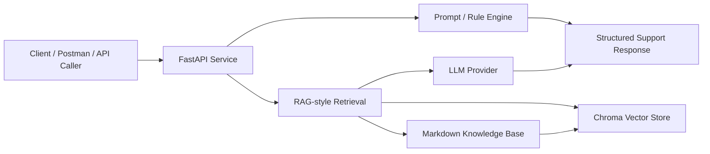

# CloudSupport AI

AI Support Workflow Prototype for Cloud and LLM Technical Support

CloudSupport AI is a lightweight AI-assisted support workflow prototype for cloud products and LLM API support scenarios. It helps transform repeated support patterns into structured diagnosis, triage, reply generation, and escalation workflows.

## Overview

CloudSupport AI validates AI-assisted technical support workflows such as knowledge base retrieval, ticket triage, API error analysis, HTTP log analysis, customer reply generation, and escalation information collection.

The backend provides RESTful APIs with stable structured JSON responses. Rule-based workflows can run locally without an LLM API key. The `/chat` endpoint demonstrates a RAG-style workflow using Markdown documents, embeddings, Chroma retrieval, prompt construction, and an external LLM provider.

## Background

Support workflows often include repeated questions, fragmented knowledge, manual ticket classification, unclear API errors, and inconsistent reply quality. This project models those patterns as reusable API workflows that can be tested with curl, Postman, or a simple frontend.

## Key Features

1. Knowledge Base Q&A
2. Ticket Triage
3. API Error Analysis
4. HTTP Log Analysis
5. Customer Reply Generation
6. Escalation Information Collection
7. RAG-style Retrieval
8. Dockerized Deployment

## Architecture



## Tech Stack

- Python
- FastAPI
- Pydantic
- Markdown Knowledge Base
- LangChain
- Chroma
- Embedding
- Docker
- Postman
- RESTful API
- LLM API / Mockable LLM Provider

## Project Structure

```text
.
├── main.py
├── rag_service.py
├── prompt_manager.py
├── classifier.py
├── log_analyzer.py
├── knowledge/
├── examples/
├── postman/
├── eval/
├── TEST_RESULT.md
├── Dockerfile
├── docker-compose.yml
├── README.md
└── README_EN.md
```

## Quick Start

```bash
git clone https://github.com/HAHAL/cloudsupport-ai.git
cd cloudsupport-ai
python -m venv .venv
source .venv/bin/activate
pip install -r requirements.txt
uvicorn main:app --reload --port 8000
```

Docker:

```bash
docker compose up --build -d
```

Swagger:

```text
http://localhost:8000/docs
```

## API Documentation

| API | Method | Purpose |
| --- | --- | --- |
| `/health` | GET | Service health check |
| `/docs` | GET | OpenAPI documentation |
| `/chat` | POST | RAG-based support Q&A |
| `/ticket-triage` | POST | Ticket classification and triage |
| `/api-debug` | POST | API error troubleshooting |
| `/log-analyze` | POST | HTTP log analysis |
| `/ticket-reply` | POST | Customer reply generation |
| `/escalation-info` | POST | Escalation information collection |

## Knowledge Base

The knowledge base covers CDN, DNS, HTTPS, HTTP status codes, video streaming, Kubernetes, LLM API errors, rate limit, timeout, authentication errors, RAG retrieval quality, and Function Calling schema issues.

## Postman Usage

Import:

```text
postman/CloudSupport-AI.postman_collection.json
```

Default variable:

```text
base_url = http://localhost:8000
```

## Test Result

See [TEST_RESULT.md](TEST_RESULT.md).

## Design Notes

1. Rule-based logic is combined with LLM output for stable first-response behavior.
2. Support responses are structured for consistent downstream display and review.
3. Escalation information is collected explicitly to reduce repeated communication.
4. Markdown knowledge base files are used for lightweight RAG-style retrieval.
5. The workflow can be extended to internal ticket systems through API integration.

## Limitations

This project is a prototype for technical support workflow validation. It does not connect to real customer data or production ticket systems by default.

## Roadmap

- Connect to real vector database
- Integrate with ticket systems
- Add authentication
- Add observability metrics
- Add multi-tenant knowledge base
- Add evaluation dataset for support answers
- Add web UI
