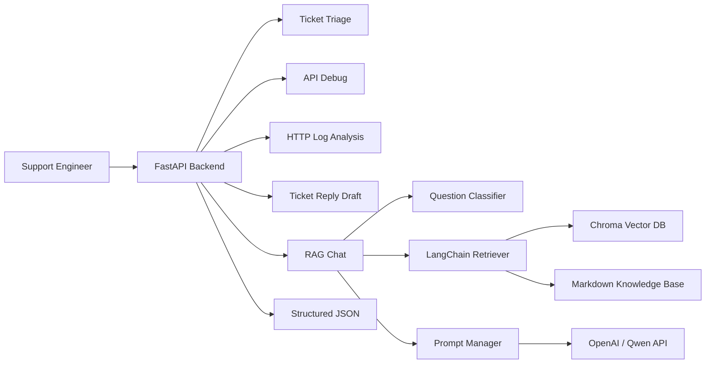

# CloudSupport AI

CloudSupport AI is a demo project for **frontline technical support of cloud products and LLM products**. It simulates common support workflows: ticket triage, RAG-based knowledge retrieval, API error diagnosis, HTTP log analysis, and customer reply drafting.

This project uses simulated sample content. It is designed for interview discussion and technical demonstration.

## Target Roles

- AI Technical Support Engineer
- Cloud Technical Support Engineer
- LLM Technical Support Engineer
- Overseas Technical Support Engineer
- AI Solution Support Engineer

## Tech Stack

- Backend: `Python`, `FastAPI`, `Pydantic`
- RAG: `LangChain`, `Chroma`, `Embedding`, `Top-K Retrieval`
- LLM API: `OpenAI / Qwen compatible API`
- Prompting: `Prompt Engineering`, structured output, anti-hallucination rules
- Deployment: `Docker`, `docker-compose`
- API Testing: `Postman`, `curl`
- Knowledge Base: Markdown support documents

## Features

| Feature | API | Description |
| --- | --- | --- |
| Health check | `GET /health` | Check service status |
| RAG chat | `POST /chat` | Retrieve knowledge base context and generate an answer |
| Ticket triage | `POST /ticket-triage` | Classify ticket category, priority, team, and missing information |
| API debugging | `POST /api-debug` | Analyze 401, 403, 429, and 5xx API errors |
| Log analysis | `POST /log-analyze` | Analyze HTTP logs such as 499, 502, 504, and timeout |
| Ticket reply | `POST /ticket-reply` | Generate a professional customer reply draft |

## Architecture



## Project Structure

```text
.
├── main.py
├── rag_service.py
├── prompt_manager.py
├── classifier.py
├── log_analyzer.py
├── index.html
├── knowledge/
│   ├── cdn/
│   ├── dns/
│   ├── https/
│   ├── video/
│   ├── kubernetes/
│   └── llm/
├── examples/
├── postman/
├── Dockerfile
├── docker-compose.yml
├── requirements.txt
├── README.md
└── README_EN.md
```

## Knowledge Base

The `knowledge/` directory contains sample Markdown documents for support scenarios:

- CDN 502/504
- CDN cache miss and high TTFB
- DNS resolution failure
- TLS certificate issue
- Video first frame slow
- HLS playback stutter
- Kubernetes Pod Pending
- LLM API 401/429/5xx
- Prompt optimization
- RAG retrieval quality
- Function Calling schema invalid

Each document follows a support-oriented structure:

- Applicable scenario
- Common symptoms
- Possible causes
- Troubleshooting steps
- Information required from the customer
- Escalation conditions

## Quick Start

### 1. Clone

```bash
git clone https://github.com/HAHAL/cloudsupport-ai.git
cd cloudsupport-ai
```

### 2. Environment Variables

For rule-based APIs such as `/ticket-triage`, `/api-debug`, `/log-analyze`, and `/ticket-reply`, an empty `.env` file is enough:

```bash
touch .env
```

For full `/chat` RAG + LLM behavior, configure an API key:

```env
LLM_PROVIDER=openai
EMBEDDING_PROVIDER=openai
OPENAI_API_KEY=your_openai_key

# Or Qwen / DashScope compatible endpoint
# LLM_PROVIDER=qwen
# EMBEDDING_PROVIDER=qwen
# DASHSCOPE_API_KEY=your_dashscope_key
```

### 3. Run with Docker

```bash
docker compose up --build -d
```

Check logs:

```bash
docker compose logs -f
```

Open API docs:

```text
http://localhost:8000/docs
```

## curl Examples

### Health Check

```bash
curl http://localhost:8000/health
```

### Ticket Triage

```bash
curl -X POST http://localhost:8000/ticket-triage \
  -H "Content-Type: application/json" \
  -d '{
    "title": "CDN accelerated API returns intermittent 504 in Singapore",
    "description": "The customer reports 504 through CDN. Nginx log shows request_time=60.001 and upstream_response_time=60.000.",
    "customer_level": "enterprise",
    "affected_product": "BytePlus CDN"
  }'
```

### API Debug

```bash
curl -X POST http://localhost:8000/api-debug \
  -H "Content-Type: application/json" \
  -d '{
    "method": "POST",
    "url": "https://ark.ap-southeast.byteplusapi.com/api/v3/chat/completions",
    "status_code": 429,
    "error_message": "Rate limit exceeded for model endpoint",
    "request_id": "req_demo_429"
  }'
```

### Log Analysis

```bash
curl -X POST http://localhost:8000/log-analyze \
  -H "Content-Type: application/json" \
  -d '{
    "log_text": "status=504 request_time=60.001 upstream_response_time=60.000 error=upstream timed out",
    "question": "Why does the CDN request return 504?"
  }'
```

### Ticket Reply

```bash
curl -X POST http://localhost:8000/ticket-reply \
  -H "Content-Type: application/json" \
  -d '{
    "ticket_title": "LLM Function Calling schema validation failed",
    "ticket_description": "Some requests return tool arguments that fail JSON schema validation.",
    "analysis_context": "Missing required fields order_id and action_type. Need raw response, schema and request_id.",
    "customer_name": "Customer"
  }'
```

## Postman

Import this file into Postman:

```text
postman/CloudSupport-AI.postman_collection.json
```

The default variable is:

```text
base_url = http://localhost:8000
```

Sample request bodies are available in:

```text
examples/
├── cdn_504_ticket.json
├── llm_api_401_error.json
├── llm_api_429_error.json
├── video_first_frame_slow.json
└── english_ticket_reply.json
```

## Interview Talking Points

- Why technical support is a good use case for RAG and rule-based fallback.
- How ticket triage, API debugging, and log analysis can be modeled as structured JSON APIs.
- How documents are loaded, split, embedded, stored in Chroma, and retrieved with Top-K search.
- How prompt rules reduce hallucination by requiring context-based answers and missing-information output.
- How overseas support scenarios require clear English replies, evidence, and escalation conditions.

## Scope

- This is an interview and learning demo.
- Knowledge base documents are sample content only.
- All knowledge base documents and examples are simulated samples.
- Rule-based fallback is used for stable demonstration.
- Full RAG chat requires a valid LLM and embedding API key.
