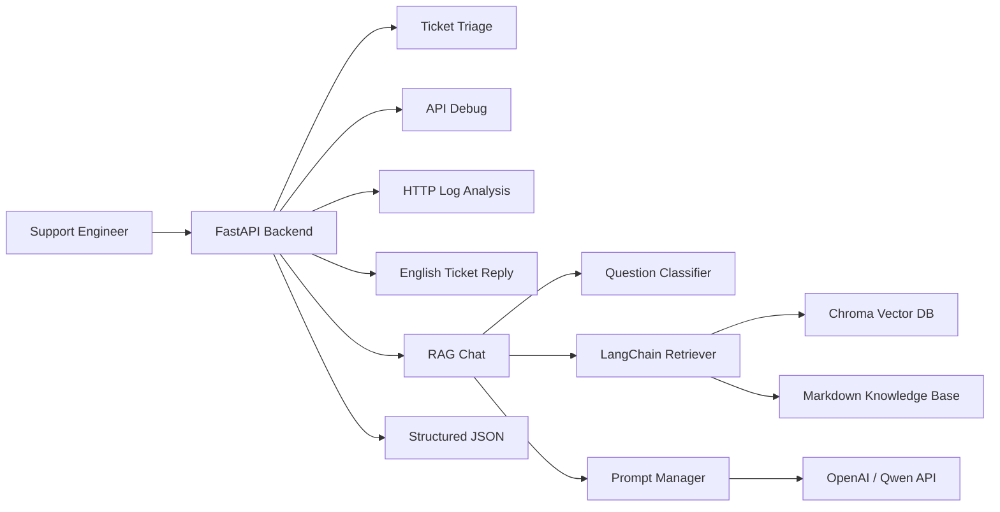

# CloudSupport AI

CloudSupport AI is an **AI Support Copilot prototype** for cloud product and LLM product support scenarios. It simulates common frontline support workflows, including ticket triage, knowledge base retrieval, API error diagnosis, HTTP log analysis, English customer reply drafting, and escalation information collection.

The project is built with `Python`, `FastAPI`, `Pydantic`, `RAG`, `Prompt Engineering`, `Postman`, and `Docker`. It is designed to demonstrate practical skills required for AI Technical Support Engineer, Cloud Support Engineer, and LLM Support Engineer roles: API debugging, troubleshooting, knowledge base organization, and customer communication.

This is a personal practice demo project. All examples are simulated support scenarios.

## Overview

The backend exposes several structured JSON APIs for technical support workflows. Some APIs use deterministic rule-based fallback logic so that they can run without an LLM API key. The `/chat` endpoint demonstrates a RAG workflow with document loading, chunking, embeddings, Chroma retrieval, prompt construction, and LLM response generation.

## Target Roles

- AI Technical Support Engineer
- Cloud Support Engineer
- LLM Support Engineer
- Overseas Technical Support Engineer
- AI Solution Support Engineer

## Tech Stack

- Backend: `Python`, `FastAPI`, `Pydantic`
- RAG: `LangChain`, `Chroma`, `Embedding`, `Top-K Retrieval`
- LLM API: `OpenAI / Qwen compatible API`
- Prompting: `Prompt Engineering`, structured output, anti-hallucination rules
- Deployment: `Docker`, `docker-compose`
- API Testing: `Postman`, `curl`
- Knowledge Base: Markdown support documents

## Core Features

| Feature | API | Description |
| --- | --- | --- |
| Health Check | `GET /health` | Check service status |
| RAG Chat | `POST /chat` | Retrieve support knowledge and generate an answer |
| Ticket Triage | `POST /ticket-triage` | Classify ticket category, priority, support team, and missing information |
| API Debug | `POST /api-debug` | Analyze API errors such as 401, 403, 429, and 5xx |
| Log Analysis | `POST /log-analyze` | Analyze HTTP logs such as 499, 502, 504, and timeout |
| Ticket Reply | `POST /ticket-reply` | Generate a professional English customer reply draft |

## API Endpoints

| API | Method | Purpose |
| --- | --- | --- |
| `/health` | GET | Service health check |
| `/docs` | GET | Swagger API documentation |
| `/chat` | POST | RAG-based support Q&A |
| `/ticket-triage` | POST | Ticket classification and triage |
| `/api-debug` | POST | API error troubleshooting |
| `/log-analyze` | POST | HTTP log analysis |
| `/ticket-reply` | POST | English ticket reply generation |

## Architecture



## Quick Start

### 1. Clone

```bash
git clone https://github.com/HAHAL/cloudsupport-ai.git
cd cloudsupport-ai
```

### 2. Environment Variables

Rule-based APIs can run with an empty `.env` file:

```bash
touch .env
```

For full `/chat` RAG + LLM behavior, configure an API key:

```env
LLM_PROVIDER=openai
EMBEDDING_PROVIDER=openai
OPENAI_API_KEY=your_openai_key

# Or Qwen / DashScope compatible endpoint
# LLM_PROVIDER=qwen
# EMBEDDING_PROVIDER=qwen
# DASHSCOPE_API_KEY=your_dashscope_key
```

### 3. Run with Docker

```bash
docker compose up --build -d
```

Open Swagger:

```text
http://localhost:8000/docs
```

## Postman Usage

Import the collection:

```text
postman/CloudSupport-AI.postman_collection.json
```

Default variable:

```text
base_url = http://localhost:8000
```

Sample request bodies:

```text
examples/
├── cdn_504_ticket.json
├── llm_api_401_error.json
├── llm_api_429_error.json
├── video_first_frame_slow.json
└── english_ticket_reply.json
```

## Knowledge Base

The `knowledge/` directory contains sample support documents:

```text
knowledge/
├── cdn/
├── dns/
├── https/
├── video/
├── kubernetes/
└── llm/
```

Covered scenarios include:

- CDN 502/504
- CDN cache miss and high TTFB
- DNS resolution failure
- TLS certificate issue
- Video first frame slow
- HLS playback stutter
- Kubernetes Pod Pending
- LLM API 401/429/5xx
- Prompt optimization
- RAG retrieval quality
- Function Calling schema errors

Each document follows a support-oriented structure:

- Scenario
- Symptoms
- Possible Causes
- Troubleshooting Steps
- Required Information
- Escalation Criteria

## Test Result

See [TEST_RESULT.md](TEST_RESULT.md).

Verified APIs:

- `GET /health`
- `GET /docs`
- `POST /chat`
- `POST /ticket-triage`
- `POST /api-debug`
- `POST /log-analyze`
- `POST /ticket-reply`

## Interview Talking Points

- Why RAG is suitable for technical support scenarios
- How ticket triage improves first response quality
- How to troubleshoot LLM API errors such as 401, 429, and 5xx
- How Prompt Engineering controls output format and reduces hallucination
- How English ticket replies reduce communication cost for overseas customers
- How to collect required information before escalating issues
- What should be added before production use: authentication, rate limiting, monitoring, evaluation, access control, and audit logs

## Limitations and Future Improvements

This project is a personal practice and interview demo project, not a production system.

Future improvements:

- Add authentication and role-based access control
- Add API rate limiting and request audit logs
- Add Prometheus and Grafana monitoring
- Add RAG evaluation dataset and answer quality scoring
- Add multi-tenant knowledge base isolation
- Add conversation history and ticket context memory
- Add CI/CD workflow for automated tests
- Add persistent ticket storage and search
- Add frontend UI for support engineers

## Scope

- All examples are simulated support scenarios.
- Rule-based fallback is used for stable demonstration.
- Full RAG chat requires a valid LLM and embedding API key.
