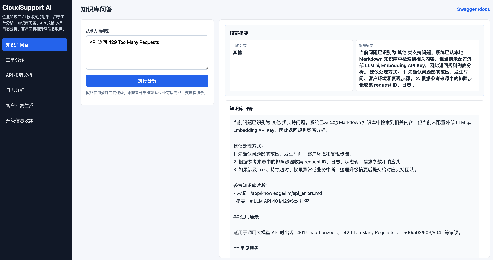
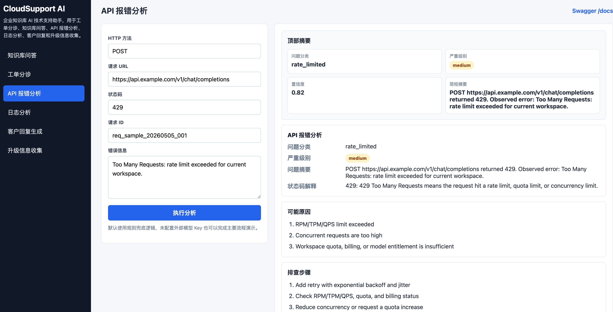
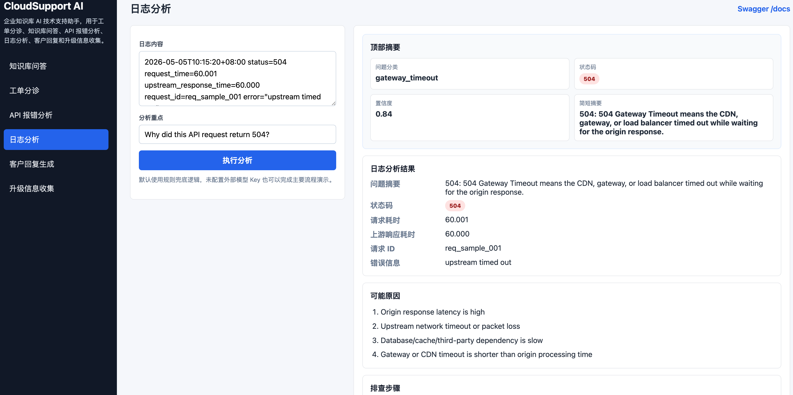
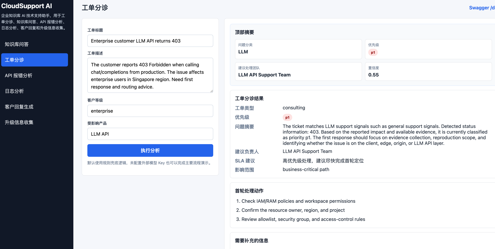
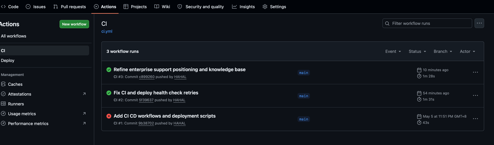
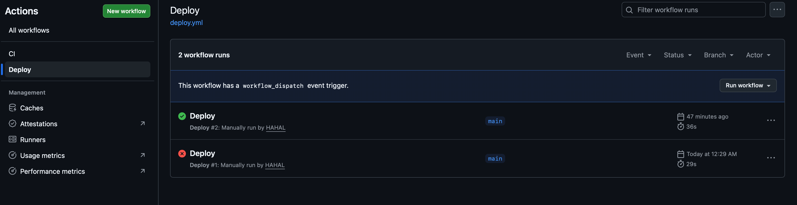

# CloudSupport AI: Enterprise Knowledge Base AI Support Assistant

CloudSupport AI is an intelligent support assistant for enterprise technical support, SaaS product support, AI application support, application operations support, and knowledge base Q&A scenarios. It is built with FastAPI, RAG, Prompt Engineering, Markdown knowledge base files, and rule-based fallback logic. It supports knowledge base Q&A, ticket triage, API error analysis, log analysis, customer reply drafting, escalation information collection, and answer feedback tracking.

The project can run without an external LLM API key. Rule-based fallback workflows are available by default. When OpenAI, Qwen, or another OpenAI-compatible provider is configured, the `/chat` endpoint can use a fuller RAG workflow.

## Overview

CloudSupport AI helps support engineers, application operations engineers, and SaaS support teams understand customer issues faster and convert repeated support patterns into structured, reusable workflows. It provides both a Web Console and Swagger API documentation for visual operation and API debugging.

The project focuses on common enterprise support workflows:

- Answering questions from an internal knowledge base
- Classifying incoming support tickets
- Analyzing API errors such as `401`, `403`, `429`, `500`, and `504`
- Analyzing HTTP, gateway, and application logs
- Drafting professional customer replies
- Collecting required information before escalation
- Recording `useful` / `not_useful` feedback for future improvement

## Key Features

1. Enterprise Knowledge Base Q&A
2. Ticket Triage
3. API Error Analysis
4. Log Analysis
5. Customer Reply Drafting
6. Escalation Information Collection
7. Answer Feedback Tracking
8. Web Console
9. Swagger API Documentation
10. Docker Deployment
11. GitHub Actions CI/CD

## Architecture

```text
User / Support Engineer
        ↓
Web Console / Swagger Docs
        ↓
FastAPI REST API
        ↓
Support Workflow Services
        ↓
Rule Engine + RAG Service + Prompt Templates
        ↓
Markdown Knowledge Base / Feedback JSONL
        ↓
Structured Diagnosis / Reply Draft / Escalation Summary
```

## Tech Stack

- Python
- FastAPI
- Pydantic
- Markdown Knowledge Base
- LangChain
- Chroma
- Prompt Templates
- Rule-based Fallback
- HTML / CSS / JavaScript Web Console
- Docker Compose
- GitHub Actions
- Postman

## Web Console

After starting the service, open:

```text
http://localhost:8000/
```

The Web Console supports:

- Knowledge base Q&A
- Ticket triage
- API error analysis
- Log analysis
- Customer reply drafting
- Escalation information collection
- Answer feedback submission

The result area displays structured diagnosis report cards by default. Raw JSON is kept for debugging and is collapsed by default.

## Quick Start

```bash
git clone https://github.com/HAHAL/cloudsupport-ai.git
cd cloudsupport-ai
python -m venv .venv
source .venv/bin/activate
pip install -r requirements.txt
uvicorn main:app --reload --host 0.0.0.0 --port 8000
```

Open:

```text
Web Console: http://localhost:8000/
Swagger:     http://localhost:8000/docs
```

Docker:

```bash
docker compose up --build -d
docker compose ps
docker compose logs -f
```

Health check:

```bash
curl -f http://127.0.0.1:8000/health
```

## API Endpoints

| API | Method | Purpose |
| --- | --- | --- |
| `/health` | GET | Service health check |
| `/chat` | POST | Enterprise knowledge base Q&A |
| `/ticket-triage` | POST | Ticket classification and routing |
| `/api-debug` | POST | API error troubleshooting |
| `/log-analyze` | POST | HTTP, gateway, and application log analysis |
| `/ticket-reply` | POST | Customer reply draft generation |
| `/escalation-info` | POST | Escalation information collection |
| `/feedback` | POST | Answer feedback tracking |
| `/docs` | GET | Swagger API documentation |

## API Examples

### Knowledge Base Q&A

```bash
curl -X POST http://localhost:8000/chat \
  -H "Content-Type: application/json" \
  -d '{
    "question": "How should we troubleshoot inaccurate enterprise knowledge base answers?"
  }'
```

### Ticket Triage

```bash
curl -X POST http://localhost:8000/ticket-triage \
  -H "Content-Type: application/json" \
  -d '{
    "title": "Customer receives 403 when logging into the admin console",
    "description": "The customer uses an enterprise account to log in to the SaaS admin console but receives Forbidden. Some users are affected.",
    "customer_level": "enterprise",
    "affected_product": "SaaS Platform"
  }'
```

### API Error Analysis

```bash
curl -X POST http://localhost:8000/api-debug \
  -H "Content-Type: application/json" \
  -d '{
    "method": "POST",
    "url": "https://api.example.com/v1/chat/completions",
    "status_code": 429,
    "error_message": "Too Many Requests: rate limit exceeded for current workspace.",
    "request_id": "req_sample_20260505_001"
  }'
```

### Log Analysis

```bash
curl -X POST http://localhost:8000/log-analyze \
  -H "Content-Type: application/json" \
  -d '{
    "log_text": "status=504 request_time=60.001 upstream_response_time=60.000 error=\"upstream timed out\" request_id=req_504_demo",
    "question": "Why did this API return 504?"
  }'
```

## Environment Variables

Rule-based workflows do not require external credentials. Full RAG behavior can be enabled with a configured model provider:

```env
LLM_PROVIDER=openai
EMBEDDING_PROVIDER=openai
OPENAI_API_KEY=your_openai_key

# Or Qwen / DashScope OpenAI-compatible endpoint
# LLM_PROVIDER=qwen
# EMBEDDING_PROVIDER=qwen
# DASHSCOPE_API_KEY=your_dashscope_key
```

Never commit real API keys or `.env` files to the repository.

## Knowledge Base

Recommended enterprise knowledge base structure:

```text
knowledge/
├── api/
│   ├── authentication-errors.md
│   ├── permission-errors.md
│   ├── rate-limit-errors.md
│   ├── timeout-errors.md
│   └── status-code-troubleshooting.md
├── web-app/
│   ├── login-failure.md
│   ├── page-slow.md
│   ├── service-unavailable.md
│   └── cors-issue.md
├── deployment/
│   ├── docker-deploy-troubleshooting.md
│   ├── nginx-reverse-proxy.md
│   └── database-connection-error.md
├── ai-support/
│   ├── rag-retrieval-quality.md
│   ├── prompt-optimization.md
│   ├── hallucination-control.md
│   └── llm-api-errors.md
└── support-process/
    ├── ticket-triage.md
    ├── customer-reply-template.md
    └── escalation-checklist.md
```

The repository still keeps some historical knowledge files. They can be gradually migrated into the general enterprise support structure above.

## Project Structure

```text
cloudsupport-ai/
├── main.py
├── app/
├── static/
│   ├── index.html
│   ├── app.js
│   └── style.css
├── knowledge/
│   ├── api/
│   ├── web-app/
│   ├── deployment/
│   ├── ai-support/
│   └── support-process/
├── examples/
├── postman/
├── docs/
│   ├── images/
│   └── videos/
├── data/
├── Dockerfile
├── docker-compose.yml
├── .github/workflows/
│   ├── ci.yml
│   └── deploy.yml
├── requirements.txt
├── .env.example
└── README.md
```

## CI/CD Workflow

CI runs on push and pull request events targeting `main`:

- Checkout repository
- Install Python dependencies
- Run Python syntax checks
- Start the FastAPI service
- Call `/health`
- Build the Docker image

CD is manually triggered through GitHub Actions:

- Connect to the server through SSH
- Run `git pull`
- Rebuild and restart the service with Docker Compose
- Verify deployment status through `/health`

Sensitive values must be configured through GitHub Actions Secrets:

- `SERVER_HOST`
- `SERVER_USER`
- `SERVER_SSH_KEY`
- `SERVER_PORT`
- `PROJECT_DIR`

Do not commit server passwords, SSH private keys, API keys, or `.env` files to the repository.

## Screenshots

### Web Console Home



### API Debug Result



### Log Analysis Result



### Ticket Triage Result



### CI Success



### Deploy Success



## Operation Demo Video

Video path:

```text
docs/videos/cloudsupport-ai-demo.mp4
```

To be added.

## Operation Flow

1. Open the Web Console.
2. Open Swagger documentation.
3. Check `/health`.
4. Run API 429 analysis.
5. Run log 504 analysis.
6. Run login 403 ticket triage.
7. Generate a customer reply draft.
8. Run knowledge base Q&A.
9. Collect escalation information.
10. Submit `useful` / `not_useful` feedback.
11. Review GitHub Actions CI/CD workflows.

## Feedback

The `/feedback` endpoint stores answer quality labels in local JSONL format:

```text
feedback/answer_feedback.jsonl
```

This file is ignored by Git and can be used to improve rules, prompts, and knowledge base content.

## Limitations

CloudSupport AI is a technical support workflow prototype. It does not connect to real customer data, ticket systems, or production monitoring systems by default. Before using it in a business environment, add authentication, authorization, audit logs, data masking, monitoring, evaluation datasets, and persistent storage.

## Roadmap

- Connect to enterprise ticket systems
- Add multi-tenant knowledge base isolation
- Add authentication and role-based access control
- Add observability metrics
- Add RAG answer evaluation
- Add feedback-driven knowledge base updates
- Add conversation history and ticket context memory
